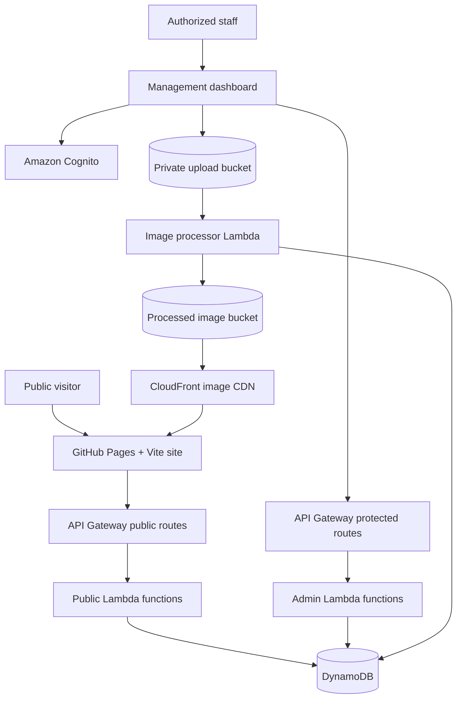

# Feathered Friends Sanctuary & Rescue

A responsive public website and serverless management system for a nonprofit parrot rescue. The project replaces a legacy Wix site with a custom frontend, a content-management dashboard, dynamic adoption profiles, automated image processing, and secure form-submission workflows built on AWS.

> This project is used by a real organization. Screenshots, sample records, and test data in the repository should never contain private applicant, volunteer, adopter, or surrender information.

## Project Status

The public website, adoptable-bird CMS, administrator authentication, image-processing pipeline, and surrender-request intake workflow are functional. Additional form workflows and administrative editing tools are under active development.

### Implemented

- Responsive multipage public website
- Shared navigation component
- Parallax hero and layered tropical artwork
- Dynamic adoptable-bird category pages
- Individual bird profile pages
- Cognito-protected management dashboard
- Create and publish/unpublish bird profiles
- Mobile photo capture and direct S3 upload
- Automatic WebP optimization and thumbnail creation
- Public surrender-request form with conditional fields
- Server-side form validation
- Protected surrender-request list and detail views
- Unreviewed and All submission filters
- Accept/reject surrender decisions
- Automatic transition from Unreviewed to Reviewed
- Downloadable text copy of a surrender submission
- GitHub Pages deployment through a Vite multipage build

### Planned

- Adoption application workflow
- Volunteer application workflow
- Boarding request workflow
- Bird profile editing and protected deletion
- Staff notes and expanded submission history
- Additional dashboard filters and pagination controls
- Optional PDF generation and email notifications
- Infrastructure as Code
- Automated frontend and Lambda tests
- Production domain migration

## Live Site

- Demo: `https://YOUR-GITHUB-USERNAME.github.io/feathered-friends/`
- Management console: `https://YOUR-GITHUB-USERNAME.github.io/feathered-friends/dashboard.html`

Replace these placeholders with the repository's actual GitHub Pages URLs. The management console requires an authorized Cognito account.

## Screenshots

Add sanitized screenshots to `docs/screenshots/` and update these links:

```md


```

Do not use screenshots containing real names, addresses, phone numbers, email addresses, veterinary records, or other private form data.

## Architecture



### Public website flow

1. Vite builds each HTML entry point as a static page.
2. GitHub Pages serves the built frontend.
3. Category pages request published bird summaries from API Gateway.
4. Individual profile pages request one published bird by slug.
5. API Gateway invokes Lambda functions that query DynamoDB.
6. Bird images are served through CloudFront from a private S3 origin.

### Administrator flow

1. Staff sign in through the dashboard.
2. Amazon Cognito authenticates the user and returns tokens.
3. The dashboard sends the access token to protected API routes.
4. API Gateway's Cognito authorizer rejects unauthenticated requests.
5. Admin Lambda functions perform limited DynamoDB or S3 operations through least-privilege IAM roles.

### Bird image flow

1. An administrator creates a draft bird profile.
2. The dashboard requests a presigned upload URL.
3. The browser uploads the original image directly to a private S3 bucket.
4. An S3 event invokes the image-processing Lambda.
5. Pillow and `pillow-heif` correct orientation and process JPEG, PNG, WebP, HEIC, or HEIF uploads.
6. The processor creates an optimized main WebP image and a 4:3 thumbnail.
7. Processed images are saved with unique keys in the image bucket.
8. The bird record is updated with `imageKey`, `thumbnailKey`, and `imageStatus`.
9. CloudFront securely serves the processed images.

### Form-submission flow

1. A visitor completes the public surrender-request form.
2. Browser validation provides immediate feedback.
3. `POST /forms/surrenders` sends structured JSON to the public submission Lambda.
4. The Lambda performs server-side validation, adds workflow fields, and creates a server timestamp and UUID.
5. The submission is stored in `ff_form_submissions` as Unreviewed and Pending.
6. Authorized staff retrieve submissions through protected dashboard routes.
7. Accepting or rejecting a request automatically marks it Reviewed.

Submitting the request does not itself transfer ownership of a bird. Final surrender or ownership-transfer documents should be reviewed independently before production use.

## Technology Stack

### Frontend

- HTML5
- CSS3
- Vanilla JavaScript ES modules
- Vite
- AWS Amplify JavaScript authentication library
- Responsive layouts using Grid and Flexbox

### AWS backend

- Amazon API Gateway HTTP API
- AWS Lambda
- Amazon DynamoDB
- Amazon Cognito User Pools
- Amazon S3
- Amazon CloudFront
- AWS IAM
- Amazon CloudWatch Logs

### Image processing

- Python 3.12
- Pillow
- `pillow-heif`
- WebP output

### Hosting and delivery

- GitHub Pages
- GitHub Actions
- CloudFront for bird images

## Repository Structure

The exact asset filenames may evolve, but the application follows this general layout:

```text
feathered-friends/
|-- index.html
|-- about.html
|-- adoption.html
|-- birds.html
|-- bird.html
|-- volunteer.html
|-- surrender.html
|-- dashboard.html
|-- vite.config.js
|-- package.json
|-- package-lock.json
|-- src/
|   |-- main.js
|   |-- dashboard.js
|   |-- surrender.js
|   |-- birds.js
|   |-- bird.js
|   |-- style.css
|   |-- components/
|   |   `-- header.js
|   `-- assets/
|       |-- categories/
|       |-- volunteers/
|       `-- ...
|-- public/
|   `-- ...
|-- .github/
|   `-- workflows/
|       `-- ...
`-- docs/
    `-- screenshots/
```

Lambda source and deployment packages may be maintained in a sibling `lambda/` directory. If backend code is included in this repository, document it with a structure such as:

```text
lambda/
|-- get-birds/
|-- get-bird/
|-- admin-birds/
|-- create-bird-upload/
|-- process-bird-image/
|-- submit-surrender/
`-- admin-submissions/
```

Do not commit generated Lambda ZIP archives or dependency-package directories unless they are intentionally part of the deployment strategy.

## Local Development

### Prerequisites

- Node.js and npm
- Git
- A modern browser
- AWS CLI for backend deployment work
- An AWS account for recreating the backend
- Python 3.12 for packaging the image-processing Lambda

### Install dependencies

```bash
npm install
```

### Start the Vite development server

```bash
npm run dev
```

Vite will print the local URL, normally:

```text
http://localhost:5173/
```

Useful local pages include:

```text
http://localhost:5173/adoption.html
http://localhost:5173/surrender.html
http://localhost:5173/dashboard.html
```

### Build the site

```bash
npm run build
```

The production output is written to `dist/`. Because this is a multipage application, confirm that all expected HTML pages are present after building:

```text
dist/index.html
dist/adoption.html
dist/surrender.html
dist/dashboard.html
```

### Preview the production build

```bash
npm run preview
```

## Vite Multipage Configuration

Every public HTML page must be included in `vite.config.js` or it will not appear in the production build.

Example:

```js
import { resolve } from "node:path";
import { defineConfig } from "vite";

export default defineConfig({
  base: "/feathered-friends/",
  build: {
    rollupOptions: {
      input: {
        main: resolve(__dirname, "index.html"),
        adoption: resolve(__dirname, "adoption.html"),
        about: resolve(__dirname, "about.html"),
        volunteer: resolve(__dirname, "volunteer.html"),
        surrender: resolve(__dirname, "surrender.html"),
        dashboard: resolve(__dirname, "dashboard.html")
      }
    }
  }
});
```

If the repository or Pages path changes, update `base` accordingly.

## Frontend Configuration

The frontend requires these public identifiers:

```text
API Gateway invoke URL
Cognito User Pool ID
Cognito App Client ID
CloudFront image domain
```

Cognito pool IDs and app-client IDs are not passwords, but production account identifiers should not be unnecessarily duplicated in documentation. Never commit:

- AWS secret access keys
- administrator passwords
- Cognito client secrets
- private S3 object URLs
- applicant or surrender records
- session tokens

For a future configuration cleanup, expose public build-time values through Vite variables:

```env
VITE_API_URL=https://example.execute-api.us-east-1.amazonaws.com
VITE_COGNITO_USER_POOL_ID=us-east-1_example
VITE_COGNITO_USER_POOL_CLIENT_ID=example
VITE_IMAGE_CDN_URL=https://example.cloudfront.net
```

Only variables prefixed with `VITE_` are exposed to Vite client code. Do not place secrets in any `VITE_` variable because all browser-delivered values are visible to users.

## API Routes

### Public routes

| Method | Route | Purpose |
|---|---|---|
| `GET` | `/birds?category={category}` | List published birds in a category |
| `GET` | `/birds/{slug}` | Retrieve one published bird profile |
| `POST` | `/forms/surrenders` | Validate and save a surrender request |

### Protected administrator routes

| Method | Route | Purpose |
|---|---|---|
| `GET` | `/admin/birds` | List all bird profiles, including drafts |
| `POST` | `/admin/birds` | Create a draft bird profile |
| `PATCH` | `/admin/birds/{birdId}` | Publish or unpublish a bird |
| `POST` | `/admin/birds/{birdId}/upload-url` | Create a presigned original-image upload URL |
| `GET` | `/admin/submissions` | Query submissions by form type and review view |
| `GET` | `/admin/submissions/{submissionId}` | Retrieve one complete submission |
| `PATCH` | `/admin/submissions/{submissionId}` | Accept or reject a submission and mark it reviewed |

Protected routes require a valid Cognito bearer token:

```http
Authorization: Bearer ACCESS_TOKEN
```

Never rely on the dashboard hiding controls as authorization. API Gateway and IAM enforce access on the backend.

## DynamoDB Data Model

### `ff_birds`

Stores public and administrative bird-profile information.

Primary key:

```text
birdId: String
```

Important fields include:

```text
birdId
birdName
slug
category
species
ageText
sex
shortDescription
fullDescription
publishStatus
categoryStatus
categorySort
imageStatus
imageKey
thumbnailKey
originalImageKey
createdAt
updatedAt
```

Indexes:

| Index | Partition key | Sort key | Purpose |
|---|---|---|---|
| `CategoryStatusIndex` | `categoryStatus` | `categorySort` | Published birds by category |
| `SlugIndex` | `slug` | None | Individual public bird lookup |

### `ff_form_submissions`

Stores surrender, adoption, volunteer, boarding, and future form submissions.

Primary key:

```text
submissionId: String
```

Common workflow fields:

```text
submissionId
formType
submittedAt
reviewStatus
typeReviewStatus
decision
reviewedAt
reviewedBy
decisionAt
decisionBy
updatedAt
```

Form answers are grouped into DynamoDB maps. A surrender record currently includes maps such as:

```text
contact
identification
health
diet
behavior
belongings
surrenderDetails
agreement
```

Indexes:

| Index | Partition key | Sort key | Purpose |
|---|---|---|---|
| `FormTypeSubmittedAtIndex` | `formType` | `submittedAt` | All submissions for a form type |
| `TypeReviewStatusIndex` | `typeReviewStatus` | `submittedAt` | Unreviewed or reviewed submissions by type |

Example workflow values:

```text
formType: surrender
reviewStatus: unreviewed
typeReviewStatus: surrender#unreviewed
decision: pending
```

After an administrator accepts the surrender request:

```text
reviewStatus: reviewed
typeReviewStatus: surrender#reviewed
decision: accepted
```

## S3 Object Layout

Original images are stored separately from processed public images.

Example incoming key:

```text
incoming/{birdId}/{uploadId}/original.jpg
```

Example processed keys:

```text
birds/{birdId}/{uploadId}-main.webp
birds/{birdId}/{uploadId}-thumbnail.webp
```

The original upload bucket and processed image bucket should remain private. CloudFront Origin Access Control should be used to serve processed images without making the S3 bucket public.

## Authentication and Authorization

- Dashboard users authenticate through an Amazon Cognito User Pool.
- Public self-registration is disabled.
- Administrator accounts are created by an authorized operator.
- The browser app uses a Cognito app client without a client secret.
- API Gateway protects administrator routes with a Cognito/JWT authorizer.
- Public bird and form-submission routes intentionally do not require Cognito.
- Lambda execution roles receive only the actions and resource ARNs required by each function.

Examples of least-privilege separation:

- Public form Lambda: `dynamodb:PutItem` on `ff_form_submissions`
- Admin submissions Lambda: `GetItem`, `Query`, and `UpdateItem`
- Upload URL Lambda: permission to create uploads only in the incoming prefix
- Image processor: read incoming images, write processed images, and update `ff_birds`

## Privacy and Data Handling

Form submissions may contain personally identifiable and sensitive information, including:

- names and addresses
- phone numbers and email addresses
- veterinary contact information
- animal medical information
- typed acknowledgements

Recommended production practices:

- Keep all form-retrieval APIs behind Cognito.
- Never log complete form bodies in CloudWatch.
- Keep uploaded documents and generated files in private S3 buckets.
- Use HTTPS for every API and asset request.
- Limit administrator access to approved staff.
- Establish and document a data-retention policy.
- Remove or anonymize test submissions.
- Avoid production data in screenshots, issues, pull requests, or commits.
- Enable CloudTrail and appropriate monitoring for production operations.
- Review surrender and electronic-acknowledgement language with qualified counsel.

## Accessibility and UX

The frontend includes or targets:

- semantic navigation, sections, headings, forms, and tables
- keyboard-accessible menu and dashboard controls
- visible focus states
- labeled form inputs
- ARIA live regions for loading, validation, and success messages
- responsive mobile layouts
- reduced-motion support
- disabled states during asynchronous operations
- conditional fields that remain excluded from submission while hidden

Future accessibility work should include automated checks and testing with keyboard-only navigation and screen readers.

## Deployment

### Public frontend

The frontend is built with Vite and deployed to GitHub Pages through GitHub Actions.

Typical workflow:

```text
Push to the deployment branch
        |
GitHub Actions installs dependencies
        |
Vite builds the multipage site
        |
The dist directory is published to GitHub Pages
```

When adding an HTML page:

1. Add the file to the repository root.
2. Add it to `vite.config.js`.
3. Run `npm run build` locally.
4. Confirm the page exists in `dist/`.
5. Commit both source and dependency-lock changes when applicable.

### Lambda functions

Simple functions can be edited in the Lambda console or deployed with the AWS CLI. Functions with compiled dependencies, such as Pillow and `pillow-heif`, must be packaged for the Lambda Linux runtime.

Example code upload:

```bash
aws lambda update-function-code \
  --function-name FUNCTION_NAME \
  --zip-file fileb://function.zip \
  --region us-east-1
```

Do not commit AWS credentials or local CLI configuration.

## Testing

Current testing is primarily manual and integration-focused.

Recommended smoke tests:

### Public site

- Navigation works from every HTML page.
- Mobile menu opens and closes with keyboard and pointer input.
- Bird category pages load the correct published birds.
- A single bird card remains thumbnail-sized.
- Individual bird pages load by slug.
- Unpublished birds cannot be retrieved through public routes.

### Bird dashboard

- Unauthenticated protected routes return Unauthorized.
- Authorized staff can list all birds.
- A draft bird can be created from desktop and mobile.
- JPEG, PNG, WebP, HEIC, and HEIF uploads are accepted.
- The image processor creates both WebP variants.
- A bird cannot be published before processed images are ready.
- Publishing and unpublishing update the public site.

### Surrender workflow

- Required fields are enforced in the browser and Lambda.
- Conditional fields appear and disappear correctly.
- A valid request receives a confirmation ID.
- The new request appears in the Unreviewed dashboard view.
- The complete request opens through the protected detail route.
- Accepting or rejecting marks the request Reviewed.
- Reviewed requests leave the default Unreviewed list and remain in All.
- The Download button creates a readable local copy.

## Design Decisions

### Vanilla multipage frontend

The public site uses static HTML and focused JavaScript modules instead of a large frontend framework. This keeps the site easy to host, fast to load, and straightforward for a nonprofit to maintain.

### Serverless AWS backend

API Gateway, Lambda, DynamoDB, S3, Cognito, and CloudFront provide usage-based scaling without maintaining a continuously running server.

### One submissions table

All form types share `ff_form_submissions`. DynamoDB's flexible item structure allows each form to store different answer maps while common workflow fields support reusable administrator routes and dashboard components.

### Separate public validation functions

Each public form should use a dedicated Lambda, such as:

```text
ff-submit-surrender
ff-submit-adoption
ff-submit-volunteer
ff-submit-boarding
```

The functions write to the same table but enforce form-specific fields and validation rules.

### Asynchronous image processing

The browser uploads originals directly to S3. Image conversion occurs after upload, preventing API Gateway and the dashboard Lambda from carrying large image bodies.

### Publication state as a string

Bird publication uses explicit string states such as `draft` and `available` rather than a Boolean. This leaves room for future states and makes records easier to understand when inspecting DynamoDB.

## Troubleshooting

### A new HTML page returns 404 on GitHub Pages

- Add the page to `vite.config.js`.
- Run `npm run build`.
- Confirm the page appears in `dist/`.
- Use the repository base path in deployed URLs.

### The browser reports a CORS error

- Add the frontend origin to the HTTP API CORS configuration.
- Add the required method, such as `GET`, `POST`, or `PATCH`.
- Allow `content-type` for JSON requests.
- Allow `authorization` for protected requests.
- In the AWS console, click Add after entering each value, then save.

### A protected route returns Unauthorized

- Confirm the user is signed in.
- Confirm the request includes `Authorization: Bearer TOKEN`.
- Confirm the route has the correct Cognito authorizer.
- Confirm the authorizer uses the intended user pool and app client.

### Images upload but cannot be published

- Check the image processor's CloudWatch logs.
- Verify the S3 event uses the `incoming/` prefix.
- Verify the processor can read the upload bucket and write the processed bucket.
- Confirm DynamoDB contains `imageKey`, `thumbnailKey`, and `imageStatus: ready`.

### Processed images return AccessDenied

- Confirm CloudFront points to the S3 bucket origin.
- Confirm Origin Access Control is enabled.
- Confirm the bucket policy permits that CloudFront distribution.
- Verify that the requested file extension and S3 object key match exactly.

### Text displays garbled punctuation or encoding characters

- Save source files as UTF-8.
- Keep `<meta charset="UTF-8">` near the beginning of each HTML `<head>`.
- Prefer plain ASCII punctuation in JavaScript status messages when files pass through tools that may alter encoding.

## Contributing

This repository supports a real nonprofit workflow. Before contributing:

1. Do not include production applicant or bird-surrender data.
2. Create a focused branch.
3. Test public and protected workflows locally.
4. Run a production build.
5. Document any AWS permission or configuration changes.
6. Keep IAM permissions limited to the required resources and actions.

## License

No open-source license is currently included. Unless a `LICENSE` file is added, the source code and project assets should be treated as all rights reserved.

Third-party photographs, organization branding, and generated artwork may have separate usage restrictions and are not automatically covered by any future source-code license.

## Acknowledgements

Built for Feathered Friends Sanctuary & Rescue, Inc. to support parrot rescue, rehabilitation, responsible guardianship, and adoption.